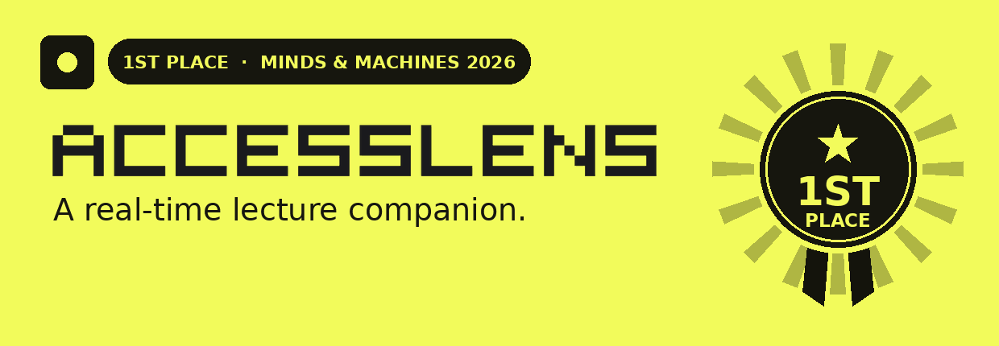
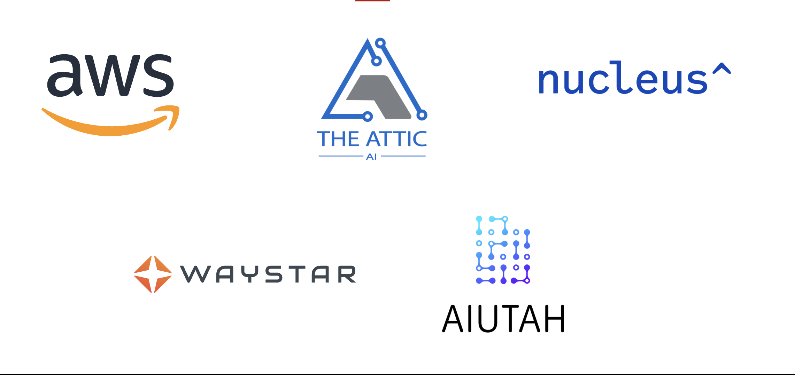
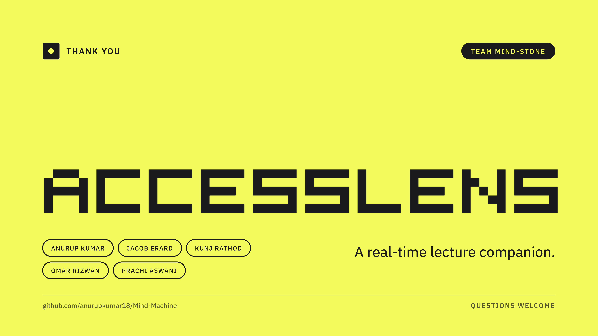

<div align="center">



<br /><br />


[](https://rai.utah.edu/events/hackathon/)
[](https://rai.utah.edu/)
[](#accesslens-on-aws)

**A real-time lecture companion.** Keep every student synchronized with the instructor's live screen, rendered in a form they can actually access.

</div>

---
</div>

### Thank you to the sponsors and hosts

<div align="center">



</div>

---

## The one-format classroom

An instructor presents a slide, diagram, video, website, or simulation in **one form**. Students who cannot see, hear, parse, translate, or sustain attention on that form lose the lesson as the class moves on.

AccessLens is a browser extension that keeps every student in sync with the instructor's live screen and renders the same lesson in a form each student can access.

---

## How it works

The instructor **explicitly** starts a session and picks a tab, window, or screen to share. The instructor extension recognizes the current approved asset and emits small semantic events (slide ID, highlighted region, pointer position, caption segment, sequence number) through a temporary AWS session. Student extensions follow automatically and render each event through the mode the student chose.

```text
Instructor opens the extension
        -> starts a session
        -> picks a tab / window / screen
        -> advances an approved deck
        -> extension emits slide / region / pointer events

Student opens the extension
        -> joins with a code
        -> chooses an access mode once
        -> automatically follows the instructor
        -> reads and listens at their own pace
```

### Access modes

| Mode | What the student gets |
|:---|:---|
| **Screen readers** | Every reviewed description is plain text that VoiceOver, NVDA, JAWS, and ChromeVox read as the lesson moves. No separate audio mode. |
| **Focus** | One region or relationship at a time. |
| **Read** | Structured text, read-aloud, or approved language support. |
| **Dyslexic** | Student-controlled spacing, line length, and dyslexic-friendly typography for the same reviewed text. |
| **Locate** | Spatial directions or haptics. |
| **Explore in AR** | A synchronized spatial model of the current concept, with keyboard, touch, voice, and non-immersive equivalents. |

Students do not need a camera for the core experience. Camera recognition is a future, opt-in fallback for content that cannot be screen-shared, such as lab equipment, specimens, studio work, and physical demonstrations.

---

## AccessLens on AWS

Six CDK stacks, one account, `us-east-1`. Every model call and every upload goes through Lambda, never from the browser. No AWS keys anywhere in the client.

<div align="center">


</div>

| Stage | Stack | What runs |
|:---|:---|:---|
| **Live** | `AccessLensLiveSession` | API Gateway WebSocket, Relay Lambda validates every event, Captions via Amazon Transcribe streaming, DynamoDB sessions with TTL |
| **Accessibility** | `AccessLensAccessibility` + `OrbExplain` | Catch-up recap and explain-what-I-missed on **Claude via Amazon Bedrock**, spoken and translated with **Amazon Polly** and **Amazon Translate** |
| **Before class** | `AccessLensAuthoring` | Google sign-in HTTP API, Step Functions library builders, **S3 Vectors** course library |
| **Delivery** | `AccessLensDistribution` | CloudFront + S3 for the landing page, extension zip, hosted app, and reviewed packs |
| **On upload** | `AccessLensCourseMedia` | Presigned S3 upload, container Worker Lambda (LibreOffice, poppler, ffmpeg), Transcribe captions, Bedrock alt text, EventBridge finish, DynamoDB |
| **Deploy** | GitHub OIDC | GitHub Actions to CloudFormation/CDK, CodeBuild builds the worker image to ECR |

<div align="center">


</div>

---

## Built responsibly, on purpose

The MVP uses checked-in mock content. It does **not** scrape Canvas, silently capture a screen, store recordings, infer disability or attention, or grade students. Captions are off by default and turn on only beside a consent notice.

---

## Team Mind-Stone

Built at the **Minds & Machines: AI in Education Hackathon**, One-U Responsible AI Initiative, University of Utah, September 2026.

**Anurup Kumar · Jacob Erard · Kunj Rathod · Omar Rizwan · Prachi Aswani**

<div align="center">



<div align="center">

**AccessLens** · 1st Place, Minds & Machines: AI in Education Hackathon 2026 · Team Mind-Stone

*Powered by AWS and Amazon Bedrock.*

</div>
