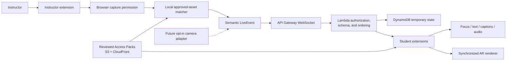

# AccessLens

## One Lesson, Every Way of Learning

**Hackathon:** Minds & Machines: AI in Education Hackathon

**Primary track:** Learn

**Status:** Main product direction; extension and AWS service not yet implemented

**Tagline:** The instructor shares once. Every student follows in the form they can access.

## 1. Executive Summary

AccessLens is a browser extension that keeps students synchronized with an
instructor's explicitly shared screen. The instructor starts a temporary session,
chooses a browser tab, window, or display through the browser's permission dialog,
and teaches normally. The extension identifies the current approved slide, diagram,
video, website, or demonstration and publishes small semantic events such as the
current asset, region, pointer location, caption segment, and sequence number.

Student extensions follow automatically. Each student receives a synchronized AR
view and can also choose audio description, a reduced-clutter Focus View, structured
text, captions, approved terminology or language support, and spatial guidance. The
instructor shares once; students do not need to hold up cameras, refresh a page, or
identify the current slide manually.

AccessLens is designed first with disabled and neurodivergent students but is
available to everyone without requiring a diagnosis or accommodation disclosure.

AR is a required part of the core student extension: the same live event that marks
the instructor's current region highlights and labels it in a reviewed spatial
model. Camera recognition is the separate advanced input adapter for physical
content that cannot be screen-shared, such as laboratory equipment, specimens,
studio work, field observations, and vocational demonstrations.

## 2. The Real Problem

### The one-format classroom

An instructor may communicate an important idea through a crowded slide, fast
verbal explanation, unlabeled diagram, animation, screen demonstration, or pointer
movement. That moment can disappear before every student can access or process it.

- A blind or low-vision student may not know which region is being indicated.
- A deaf or hard-of-hearing student may miss the relationship between speech and a
  changing visual.
- A student with ADHD may lose the key idea inside a visually dense screen.
- A dyslexic student may need clearer structure or read-aloud support.
- A multilingual student may understand the concept but need terminology support.
- A student far from the screen, temporarily injured, or reviewing remotely may
  encounter the same barrier.

Support is often reactive and separate. Students may need to recognize the barrier,
disclose a disability, request an accommodation, and wait for another version while
the class continues.

> Students need access to the same idea at the same moment, without disclosing a
> diagnosis or operating a separate workflow throughout class.

## 3. How the System Works

### Before class: build an Access Pack

For an instructor-approved asset, AccessLens prepares a draft Access Pack:

- asset identity and local matching fingerprint;
- logical reading order;
- concise audio and alternative descriptions;
- important regions and spatial relationships;
- course terminology and plain-language structure;
- approved language support;
- captions or transcript where relevant; and
- an AR scene, semantic hotspots, and equivalent non-immersive access paths.

The instructor reviews and publishes the pack. Machine-generated content is never
treated as approved automatically.

### During class: instructor shares once

1. The instructor opens the AccessLens browser extension.
2. They select **Start Session**.
3. The browser asks them to choose a tab, window, or screen.
4. Instructor-side processing matches the view to an approved Access Pack.
5. The extension sends semantic events through a temporary AWS WebSocket session.
6. The instructor can pause, stop, or correct a wrong match at any time.

The browser must ask for capture permission. AccessLens cannot and should not work
around that safeguard.

### During class: students follow automatically

1. The student joins the temporary class session.
2. Their extension receives the current asset and region event.
3. The extension loads the exact reviewed Access Pack version.
4. It renders the current moment using the student's locally stored preferences.
5. Slide changes, pointer movement, and captions update without student action.
6. The AR scene highlights the same current region and exposes its approved label
   and relationship.

The server does not need to know which accessibility mode a student selected.

## 4. Student Modes

### Hear

Play concise, student-requested descriptions of the current visual or region without
continuously talking over the instructor.

### Focus

Remove unrelated visual clutter, enlarge the active region, strengthen contrast,
and present one relationship at a time.

### Read

Expose a logical reading order, headings, transcript, read-aloud support, and
instructor-approved terminology or language support.

### Locate

Convert a normalized pointer or region into screen-relative directions, spatial
audio, or haptics on supported devices.

### Explore in AR

Open the reviewed spatial representation and synchronize its view, selected object,
label, and hotspot with the instructor's current event. Immersive AR is used on
supported devices; the same scene remains manipulable in the extension on other
devices. Its labels and relationships also have touch, keyboard, voice, and
screen-reader paths.

## 5. Examples Across Courses

| Setting | Instructor shares | AccessLens can provide |
| --- | --- | --- |
| Biology | Cell diagram or process animation | Current organelle description, Focus View, and an AR cell highlighting the same structure |
| Mathematics | Equation, graph, or proof | Current term, verbalized notation, and a manipulable spatial graph or surface |
| History | Map, timeline, or primary source | Reading order plus an AR timeline or map anchored to the current place or event |
| Business | Dense chart or spreadsheet | Active series, axis description, and a spatial model of the changing relationship |
| Language | Sentence, image, or conversation prompt | Captions, pronunciation support, and AR labels tied to reviewed vocabulary |
| Art history | Painting or composition overlay | Current region, enlarged detail, and spatial overlays explaining composition |
| Software training | Website or application workflow | Current control, keyboard instructions, and spatial callouts showing the next control |
| Video | Lecture clip or animation | Synchronized captions, descriptions, and a manipulable model of the current concept |

## 6. Camera and Physical-World Extension

Some teaching cannot be screen-shared. After the browser-extension MVP is stable,
AccessLens can add a separate, opt-in camera adapter for:

- a chemistry instructor identifying valves, probes, or safety controls;
- a microscope or specimen demonstration;
- a nursing instructor positioning equipment on a mannequin;
- an engineering instructor assembling a circuit or mechanism;
- an art professor discussing a sculpture or physical canvas;
- a geology or ecology field observation;
- a music, theater, or movement demonstration; and
- vocational training on machinery or maintenance.

The instructor can use one fixed or mobile camera to publish semantic events to the
whole class. Students should not each need cameras. A student may optionally use
their own camera to inspect their personal workstation or viewpoint.

The camera adapter produces the same asset/region event used by screen sharing, so
student renderers do not change. Camera frames should be processed locally and must
not be stored, used for face recognition, or analyzed for attention or emotion.

## 7. Inclusive-by-Default Design

| Situation or preference | AccessLens support |
| --- | --- |
| Blind or low-vision | Audio description, semantic structure, spatial guidance, haptics |
| ADHD or cognitive overload | One element at a time, visible sequence, brief interactions, optional movement |
| Dyslexia | Read-aloud, reduced clutter, adjustable structure |
| Multilingual learner | Approved terminology and language support, replay |
| Deaf or hard of hearing | Captions, transcript, visual indication of the current subject |
| Limited mobility | Keyboard, touch, voice, switch-access, and reduced-movement alternatives |
| Temporary or situational barrier | Enlargement, focus, audio, captions, or hands-free access |
| Any student | Multiple representations of the same live concept |

These modes are choices, not diagnoses or fixed “learning style” profiles.

## 8. Hackathon MVP

### Demo scenario

Use one checked-in biology deck and show one instructor plus two student views.

1. Instructor starts a temporary AccessLens session.
2. Browser displays the tab/window/screen chooser.
3. Instructor shares the biology presentation.
4. Instructor advances to a cell diagram.
5. Local matching emits the approved asset and page ID.
6. Student A automatically receives Focus View.
7. Student B automatically receives the AR cell view with structured text and
   requests audio.
8. Instructor indicates the mitochondrion; both extensions update and the AR model
   focuses and labels that organelle.
9. Instructor pauses sharing; student views immediately show the paused state.
10. Instructor resumes and intentionally demonstrates manual correction after an
    unmatched slide.

### Acceptance criteria

- No student camera is required.
- Capture begins only after explicit instructor action and browser permission.
- One reviewed deck matches reliably under documented demo conditions.
- Two student views follow the same ordered event automatically.
- Focus, structured-text, audio, and AR modes use the reviewed pack.
- Every demo region maps to a valid AR hotspot and equivalent semantic control.
- A wrong or unknown source never produces an invented description.
- Instructor pause, stop, and correction controls work.
- No raw screen recording, learner profile, grade, or attention score is stored.

## 9. Technical Stack

| Layer | Technology |
| --- | --- |
| Browser extension | Chrome Manifest V3 |
| Interface | React, TypeScript, Vite, Chrome Side Panel API |
| AR rendering | Direct Three.js and WebXR `immersive-ar` where supported |
| Capture runtime | Service worker, offscreen document, content scripts, `getDisplayMedia()` or `chrome.tabCapture` |
| Local recognition | OpenCV.js; MediaPipe only after a feasibility test |
| Local preferences | `chrome.storage.local` or IndexedDB |
| Contracts | TypeScript, JSON Schema, Zod |
| Live transport | Amazon API Gateway WebSocket API |
| Backend | AWS Lambda with TypeScript |
| Temporary state | DynamoDB with TTL and application-level expiry checks |
| Approved assets | S3 and CloudFront |
| Pack integrity | AWS KMS |
| Authoring stretch | Textract, Bedrock, Translate, and Polly with human review |
| Infrastructure | AWS CDK in TypeScript |
| Testing | Vitest, Playwright, axe-core, fixture and privacy-contract tests |

Full contracts, diagrams, failure behavior, and component responsibilities are in
[`SYSTEM_DESIGN.md`](SYSTEM_DESIGN.md).

## 10. Architecture

## 11. Privacy, Safety, and Governance

AccessLens must not:

- capture a screen, microphone, or camera silently;
- transmit raw screen or camera streams to the server in the MVP;
- record a class session;
- inspect unrelated browsing activity;
- identify faces or infer disability, attention, gaze, emotion, or intent;
- evaluate voice, accent, body movement, or camera presence;
- reveal a student's selected accessibility modes to instructors;
- automatically grade or determine mastery;
- claim generated descriptions are correct before instructor review; or
- claim automatic WCAG, ADA, FERPA, or institutional compliance.

## 12. Research Foundation

### Disability access and self-advocacy

The U.S. Government Accountability Office found that the share of college students
reporting disabilities increased substantially between 2004 and 2020, with growth
driven partly by mental-health and attention-related conditions. Students with
disabilities graduated at lower rates, and students and disability-services staff
described barriers around knowing how to request and advocate for accommodations.[^gao]

**Design response:** make modes available without collecting a diagnosis while
keeping formal accommodations intact.

### Digital-accessibility urgency

The Department of Justice's Title II web and mobile rule establishes WCAG 2.1 Level
AA as the technical standard for covered state and local government content. After
an April 2026 interim extension, the current general deadlines are April 26, 2027,
or April 26, 2028, depending on the entity.[^ada]

**Design response:** preserve source provenance, require instructor review, improve
the shared experience instead of relying on a permanently separate version, and
never claim that AccessLens certifies compliance.

### Universal Design for Learning

CAST's Universal Design for Learning Guidelines emphasize multiple means of
engagement, representation, and action and expression, along with learner choice,
accessible technology, and support for language, symbols, and organization.[^udl]

**Design response:** students choose among equivalent representations; the system
does not assign them to a learning-style category.

### ADHD and executive-function support

The U.S. Centers for Disease Control and Prevention identifies classroom supports
including clear expectations, immediate feedback, organizational support, reduced
distraction, technology assistance, and opportunities for movement or breaks.[^cdc]

**Design response:** Focus View presents one relationship at a time with visible
next steps and optional—not required—movement. AccessLens does not diagnose or
treat ADHD.

### Embodied interaction

Research on brief classroom activity and embodied learning supports cautious
experimentation, but it does not prove that this extension or AR improves university
outcomes. A study of 35 children reported improved observed on-task behavior after
short activity breaks under its conditions.[^breaks] A 2026 meta-analysis of
embodied vocabulary learning reported positive effects while warning about
small-study effects and found that meaningful alignment between movement and the
concept mattered.[^embodied]

**Design response:** AR must represent the concept, while movement and immersive
device use remain optional through equivalent controls. The hackathon should
measure usability and technical performance, not claim improved grades or retention.

## 13. 48-Hour Plan

### Hours 1–6: contracts and extension shell

- Build Instructor and Student side-panel modes.
- Define and validate one Access Pack and Live Event schema.
- Create the reviewed biology fixture.

### Hours 7–18: instructor sharing

- Implement Start, browser capture chooser, Pause, Resume, and Stop.
- Match only the reviewed biology slides locally.
- Add manual source correction.

### Hours 19–30: live AWS session

- Create/join/close temporary sessions.
- Relay ordered semantic events through WebSockets.
- Connect two student views and handle reconnect.

### Hours 31–40: accessible modes

- Implement Focus, structured-text, and requested audio modes.
- Implement the synchronized AR cell scene and semantic hotspot mapping.
- Add keyboard and screen-reader checks.
- Ensure preferences stay local.

### Hours 41–48: validation and presentation

- Test permission denial, wrong match, disconnect, stale event, and stop.
- Gather feedback from relevant design partners where possible.
- Rehearse twice and record a backup demo.
- Start the advanced camera-source adapter only if the complete extension and AR
  demo is stable.

## 14. Judging Alignment

| Criterion | AccessLens evidence |
| --- | --- |
| Impact | Addresses the moment students lose access while a live lesson continues. |
| Innovation | Synchronizes one instructor event into several student-controlled accessible representations. |
| Feasibility | Restricts the MVP to one reviewed deck, one paired extension package, one reviewed AR scene, and temporary semantic events. |
| Technical depth | Combines explicit capture, local matching, real-time AWS delivery, synchronized AR, accessible rendering, and privacy contracts. |
| Responsible AI | Requires human review, minimizes data, avoids surveillance and diagnosis, and bounds claims. |
| Design | Students choose modes once and then follow automatically. |
| Presentation | Judges can see one instructor action update two different student experiences instantly. |
| Scalability | New Access Packs and capture adapters reuse the same Live Event and renderer contracts. |

## 15. One-Sentence Pitch

**AccessLens is a browser extension that follows an instructor's shared screen and
automatically turns the same live lesson into synchronized AR, focused visuals,
structured text, captions, audio, and spatial guidance—without requiring students
to disclose a diagnosis or operate a camera as an input source.**

## 16. Evidence Still Required

Before using a lived-experience story in the pitch, interview at least one student
who encounters the selected barrier and one accessibility or instructional-design
professional. Hackathon feedback is usability evidence, not proof that AccessLens
improves learning, grades, retention, or graduation.

[^gao]: U.S. Government Accountability Office, [“Higher Education: Education Could Improve Information on Accommodations for Students with Disabilities”](https://www.gao.gov/products/gao-24-105614), 2024.
[^ada]: U.S. Department of Justice, [“First Steps Toward Complying with the Americans with Disabilities Act Title II Web and Mobile Application Accessibility Rule”](https://www.ada.gov/resources/web-rule-first-steps/), including the April 2026 interim deadline extension.
[^udl]: CAST, [“Universal Design for Learning Guidelines 3.0”](https://udlguidelines.cast.org/), 2024.
[^cdc]: U.S. Centers for Disease Control and Prevention, [“ADHD in the Classroom: Helping Children Succeed in School”](https://www.cdc.gov/adhd/treatment/classroom.html).
[^breaks]: Ma, Le Mare, and Gurd, [“Classroom-based high-intensity interval activity improves off-task behaviour in primary school students”](https://pubmed.ncbi.nlm.nih.gov/34780315/), 2021.
[^embodied]: [“Learning vocabulary through embodied learning: a meta-analysis”](https://link.springer.com/article/10.1007/s10648-026-10194-9), *Educational Psychology Review*, 2026.
