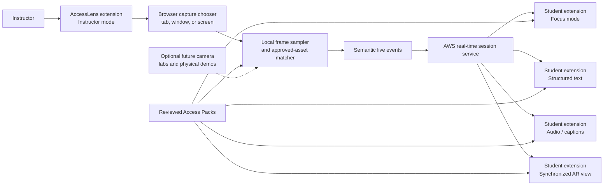
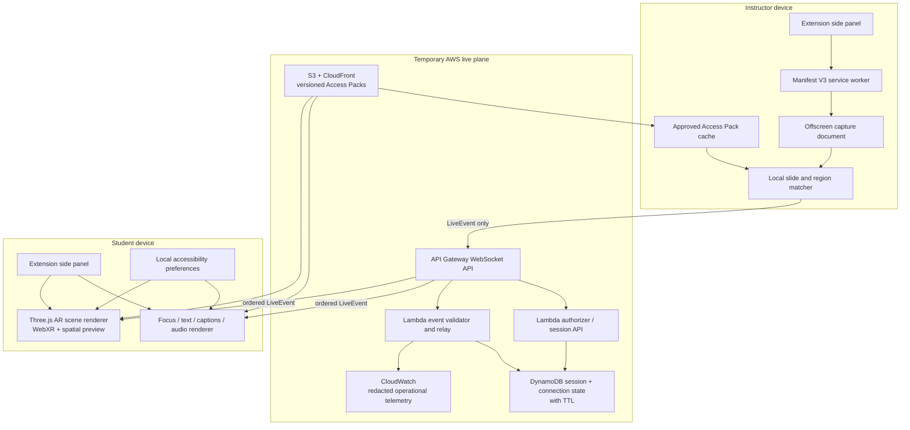
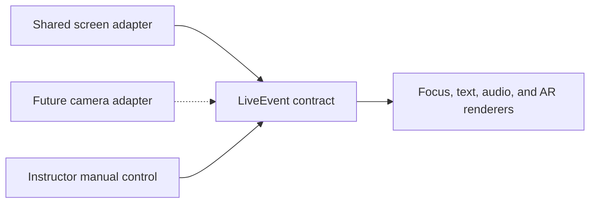

# AccessLens System Design

## 1. Architecture goals

AccessLens must:

1. keep student views synchronized with an instructor's explicitly shared screen;
2. transmit semantic state rather than raw screen video by default;
3. render the same instructional meaning through several accessible modes;
4. work without production Canvas access in the hackathon;
5. make incorrect recognition visible and correctable; and
6. make AR a core renderer while keeping camera-based source recognition an
   independent advanced adapter.

## 2. System context



## 3. Runtime architecture



## 4. Why a browser extension

The extension stays with the instructor and student across presentation tools and
web pages. It can provide a persistent side panel, local preferences, explicit
capture controls, content scripts for supported presentation pages, and an
offscreen document for capture processing across navigation.

Browsers intentionally require user participation for capture. `getDisplayMedia()`
shows a source chooser, requires a user action, and does not allow capture permission
to be permanently reused. Chrome's `desktopCapture` similarly presents a chooser
for a screen, window, or tab.[^display-media][^desktop-capture] This is a product
safeguard, not a limitation to bypass.

The MVP should request the narrowest permissions possible:

- `activeTab` for temporary access after the instructor invokes the extension;
- `scripting` only for supported pages where semantic DOM extraction is useful;
- `storage` for local settings and cached reviewed packs;
- `sidePanel` for the persistent interface; and
- either `tabCapture` or explicit `getDisplayMedia()` for instructor sharing.

Avoid broad host permissions in the MVP.

## 5. Live flow

### Start

1. Instructor opens the side panel and selects **Start AccessLens Session**.
2. The extension creates a temporary instructor capability and a student join code.
3. The browser asks the instructor to choose a tab, window, or screen.
4. Capture begins only after the instructor confirms the source.
5. Students enter the join code or open a preconfigured demo link.

### Recognize

1. The offscreen document samples the shared stream at a bounded rate.
2. Local matching compares a sample with thumbnails from the approved Access Pack.
3. If confidence passes the reviewed threshold, the matcher emits an asset and page
   ID. Otherwise, it emits `unmatched` and asks the instructor to select manually.
4. A supported presentation content script may provide exact slide IDs, reducing
   dependence on computer vision.
5. Pointer coordinates are normalized to the shared content area and mapped to a
   configured region when pointer support is enabled.

### Synchronize

1. The instructor extension sends an allowlisted `LiveEvent` through API Gateway.
2. Lambda validates the instructor capability, event schema, pack version, and
   monotonically increasing sequence number.
3. API Gateway's WebSocket connection relays the event to joined student clients.
4. A reconnecting student requests only the latest semantic state.
5. Closing the session invalidates the capability and stops delivery.

API Gateway WebSocket APIs support two-way persistent client communication and
backend callbacks, which fits temporary instructor-to-student event delivery.[^aws-ws]

### Render

Each student extension loads the same reviewed pack but applies local preferences:

- Focus mode crops or reconstructs the current approved region.
- Structured mode follows the reviewed reading order.
- Dyslexic mode presents the same reviewed text with student-controlled spacing,
  line length, and dyslexic-friendly typography.
- Caption mode displays instructor-approved or live caption segments.
- Audio mode speaks concise reviewed descriptions only when requested.
- Locate mode translates normalized position into screen-relative language or
  haptic cues on supported devices.
- AR mode maps the current asset and region IDs to a reviewed 3D scene, moves focus,
  highlights the selected structure, and opens its approved label or hotspot.

The backend does not need to know which mode a student selected.

The AR renderer is always part of the student extension. On compatible mobile or XR
devices it can request an `immersive-ar` WebXR session. On other devices it renders
the same spatial scene in an extension-owned interactive viewport. A semantic
outline exposes the same labels and relationships to keyboard and screen-reader
users. This adaptive presentation is an accessibility requirement, not removal of
AR from the product.[^webxr][^three-xr]

## 6. Data contracts

### Access Pack

```json
{
  "schemaVersion": "1.0",
  "packId": "bio-cell-demo",
  "version": 1,
  "title": "Cell Structure",
  "assets": [
    {
      "assetId": "cell-slide-03",
      "fingerprint": "reviewed-local-match-fingerprint",
      "title": "Cell membrane and organelles",
      "readingOrder": ["title", "membrane", "mitochondrion"],
      "regions": [
        {
          "regionId": "mitochondrion",
          "bounds": {"x": 0.35, "y": 0.22, "width": 0.18, "height": 0.24},
          "shortDescription": "The mitochondrion releases usable energy for the cell.",
          "plainLanguage": "This structure helps power the cell."
        }
      ],
      "arScene": {
        "modelUri": "models/cell.glb",
        "defaultCamera": "cell-overview",
        "hotspots": [
          {
            "hotspotId": "mitochondrion-hotspot",
            "regionId": "mitochondrion",
            "nodeName": "Mitochondrion",
            "label": "Mitochondrion"
          }
        ]
      }
    }
  ]
}
```

All coordinates are normalized from 0 to 1. Packs are versioned and reviewed before
publication.

#### Known gaps between this section and `packages/contracts/`

Part 1's contracts landed in `df80b5d`. Running the reviewed pack and its
fixtures through them found two correctness bugs and four additive gaps; the
evidence is in [`PART5_CONTRACT_CONFORMANCE.md`](PART5_CONTRACT_CONFORMANCE.md)
and reproducible with
`python3 packages/access-packs/bio-cell-demo/tools/check_contract_conformance.py`.

The two bugs, because they contradict this document and the charter:

- **`assetId` is required on every event**, which makes `source.unmatched`
  unrepresentable. Charter A9 requires unknown content to produce an unmatched
  state that names no asset. `session.started`, `session.ended`,
  `capture.paused`, and `capture.resumed` have no asset either.
- **`live-event.schema.json` omits `regionId` and `pointer`** while setting
  `additionalProperties: false`, so it rejects events the Zod schema accepts —
  including Part 1's own `validEvent` fixture. The JSON Schema is the artifact a
  service validates against, so Part 4 would reject what the extension sends.

The additive fields the pack emits that this schema does not name. They are
recorded here so the contract freeze covers them; the schema above is unchanged
until the owners agree.

1. `arScene.hotspots[].cameraTarget` — a key into a new pack-level `arCameras`
   map of `{position, target, fov}`. The AR renderer has to move the camera on a
   region change, and that framing is reviewed instructional content.
2. `arScene.hotspots[].highlight` — how the AR route marks the node; `"outline"`
   in the demo pack.
3. `hotspotId` scoped per asset, as `cell-slide-03:mitochondrion`. Several slides
   teach the same region, so a region-derived id does not resolve to one hotspot
   pack-wide, and `arState.hotspotId` must.

Note that `arState` appears in the documented LiveEvent example above but is
rejected by the current contract, so that example does not validate against its
own implementation.

The pack also carries a `matching` block — algorithm, hash width, distance
ceiling, margin, and `onNoMatch: "source.unmatched"` — so the recognition
threshold is reviewed content rather than a constant compiled into Part 2.

### Live event

```json
{
  "schemaVersion": "1.0",
  "type": "region.changed",
  "sessionId": "opaque-session",
  "packId": "bio-cell-demo",
  "packVersion": 1,
  "assetId": "cell-slide-03",
  "regionId": "mitochondrion",
  "pointer": {"x": 0.42, "y": 0.31},
  "arState": {
    "hotspotId": "mitochondrion-hotspot",
    "action": "focus"
  },
  "sequence": 18,
  "sentAt": "2026-09-15T15:00:00Z"
}
```

The event contract has no field for a raw frame, student diagnosis, selected mode,
grade, or attention signal.

### Event types

- `session.started`
- `asset.changed`
- `region.changed`
- `caption.appended`
- `capture.paused`
- `capture.resumed`
- `capture.stopped` — capture has ended, but the temporary session remains open
  for a later explicit Start on the same join code.
- `stream.started` — the instructor is streaming live video of one tab or one
  window (`surface: browser | window`) over the session's Amazon IVS Real-Time
  stage; students subscribe with the token on their capability. The video
  never touches the relay. A monitor is not a permitted surface.
- `stream.stopped` — that video has ended. `capture.stopped` and
  `session.ended` end it too.
- `source.unmatched`
- `session.ended`

## 7. Technical stack

| Layer | MVP choice | Purpose |
| --- | --- | --- |
| Extension | Chrome Manifest V3 | Instructor and student distribution surface |
| UI | React + TypeScript + Vite | Side-panel interfaces and shared components |
| AR rendering | Direct Three.js + WebXR | Required synchronized scene, hotspots, immersive AR on supported devices, and explicit renderer cleanup |
| Extension runtime | Service worker + offscreen document + content scripts | Session control, capture processing, and supported-page integration |
| Capture | `getDisplayMedia()` or `chrome.tabCapture` after user action | Explicit instructor tab/window/screen sharing |
| Local vision | OpenCV.js; optional MediaPipe after feasibility test | Reviewed-slide matching and normalized pointer/region detection |
| Local state | `chrome.storage.local` or IndexedDB | Student preferences and cached reviewed packs |
| Shared schemas | TypeScript + JSON Schema, validated with Zod | Access Pack and Live Event contracts |
| Real-time API | Amazon API Gateway WebSocket API | Temporary bidirectional session transport |
| Backend | AWS Lambda with TypeScript | Session authorization, validation, ordering, and relay |
| Session state | Amazon DynamoDB with TTL | Temporary sessions and connections |
| Assets | Amazon S3 + CloudFront | Versioned reviewed Access Packs and media |
| Integrity | AWS KMS signing | Published-pack integrity |
| Authoring stretch | Textract, Bedrock, Translate, and Polly with human review | Draft structure, descriptions, language support, and audio |
| Observability | CloudWatch with field allowlists | Redacted errors, latency, and availability |
| Infrastructure | AWS CDK in TypeScript | Reproducible hackathon deployment |
| Tests | Vitest, Playwright, axe-core, and contract fixtures | Logic, extension flows, and accessibility checks |

DynamoDB TTL is useful for aging out temporary state, but deletion is asynchronous;
application reads must reject expired records immediately rather than assume the
database has already removed them.[^dynamodb-ttl]

## 8. Supported examples

### Core screen-shared examples

- Biology: follow the indicated organelle in both a cell diagram and AR cell.
- Mathematics: isolate the current term and update its spatial graph or surface.
- History: narrate the highlighted region and focus the same place in an AR map.
- Business: focus on a crowded chart series and spatialize its changing relationship.
- Language: show approved terminology and attach it to reviewed AR object labels.
- Art history: describe a region and synchronize a spatial composition overlay.
- Software training: follow the current control with a spatial next-action callout.
- Video: synchronize captions, description, time, and a reviewed concept model.

### Future camera examples when sharing is impossible

- A lab instructor points to a valve, probe, or safety control on real equipment.
- A biology class observes a specimen under a microscope.
- A nursing instructor demonstrates the position of equipment on a mannequin.
- An engineering instructor assembles a physical circuit or mechanism.
- An art professor critiques a physical sculpture or canvas.
- A geology class identifies layers in an outdoor formation.
- A vocational instructor demonstrates a machine control or maintenance step.
- A student voluntarily inspects their own workstation from their viewpoint.

One instructor or fixed lab camera can publish semantic events to the entire class;
camera ownership is not a student requirement.

## 9. Failure behavior

| Failure | Required behavior |
| --- | --- |
| Instructor denies capture | Do not start; explain that sharing is required for live sync |
| Source is not approved or cannot be matched | Show `Unmatched`; do not invent a description; allow manual instructor selection |
| WebSocket disconnects | Mark the view stale; reconnect; request latest sequence |
| Event arrives out of order | Reject it and retain the newer state |
| Pack version differs | Stop rendering and fetch the exact approved version |
| Instructor pauses or stops capture | Freeze the last trusted student view immediately and state that sharing is not live; only `session.ended` closes the temporary session |
| Instructor ends session | Stop delivery and close student live views immediately |
| Audio is unavailable | Preserve structured text and visual focus alternatives |
| Camera stretch fails | Return to instructor/manual selection; never require student cameras |

## 10. Security and privacy boundaries

- Treat screen and camera sources as untrusted private media.
- Process frames locally in the MVP and send only allowlisted events.
- Use short-lived, role-scoped capabilities instead of reusable credentials.
- Never include Canvas tokens in the extension bundle or live event.
- Validate pack IDs, versions, event types, coordinate ranges, timestamps, and
  sequence numbers server-side.
- Rate-limit instructor events and connection attempts.
- Redact event content from logs by default.
- Keep student preferences local.
- Provide visible capture, pause, and stop indicators.
- Do not record sessions.

## 11. AR and camera boundaries

AR is an output renderer; the camera adapter is an input source. They are related
only when a supported device uses its camera to composite an immersive WebXR view.
In that case, the camera feed remains under the browser's XR permission/runtime and
AccessLens does not interpret, upload, or store it.

Camera input uses a separate adapter that produces the same semantic `LiveEvent`
contract as screen matching. It is advanced scope for understanding an instructor's
physical laboratory or field demonstration, and it does not replace the required AR
renderer.



## 12. Official implementation references

[^display-media]: MDN, [`MediaDevices.getDisplayMedia()`](https://developer.mozilla.org/en-US/docs/Web/API/MediaDevices/getDisplayMedia), including user-activation and non-persistent permission requirements.
[^desktop-capture]: Chrome for Developers, [`chrome.desktopCapture`](https://developer.chrome.com/docs/extensions/reference/api/desktopCapture), including the browser source chooser.
[^aws-ws]: AWS, [Overview of WebSocket APIs in API Gateway](https://docs.aws.amazon.com/apigateway/latest/developerguide/apigateway-websocket-api-overview.html).
[^dynamodb-ttl]: AWS, [Using time to live in DynamoDB](https://docs.aws.amazon.com/amazondynamodb/latest/developerguide/TTL.html).
[^webxr]: MDN, [WebXR Device API](https://developer.mozilla.org/en-US/docs/Web/API/WebXR_Device_API), including its secure-context and browser-support constraints.
[^three-xr]: Three.js, [`WebXRManager`](https://threejs.org/docs/pages/WebXRManager.html), the renderer interface used to connect a Three.js scene to a WebXR session.
