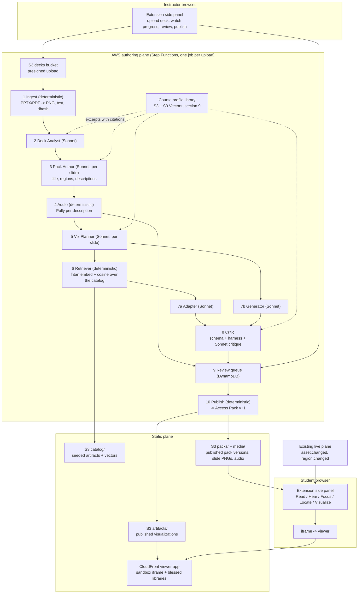

# AccessLens Authoring Pipeline and Visualization System

Status: draft spec, 2026-09-15. Owner: Jacob (Part 6), temporary hackathon AWS account.

This document defines the single authoring endpoint: an instructor uploads a slide
deck from the extension, and one AWS job produces the complete draft Access Pack
for it. That pack drives the student modes the extension renders from pack data:
Read, Hear, Focus, Locate, and the new Visualize mode. AR is out of scope for
this pipeline; it stays a Part 3 renderer driven by hand-authored `arScene`
data in checked-in packs. Deterministic tooling does
every step it can. Claude Sonnet 4.6 on Bedrock does only the steps that need
judgment: describing what a slide shows, deciding what visualization fits, and
adapting or generating one. The instructor reviews the whole draft and publishes.

It extends `docs/SYSTEM_DESIGN.md`. Where this document and the system design
disagree, this document is the intended behavior for authoring and for the
visualization surface, and the discrepancy should be recorded in
`memory/episodic/`.

`scripts/build-pack.ts` is the local prototype of stages 1 through 3 below. The
pipeline lifts its approach into Lambda rather than replacing it.

## 1. Goals and non-goals

Goals:

1. One upload produces one draft pack. The instructor never authors regions,
   descriptions, fingerprints, or visualizations by hand.
2. Work for any subject. Nothing here is biology- or CS-specific.
3. Deterministic where possible: rendering, text extraction, fingerprints,
   audio synthesis, schema validation, and render checks are code, not prompts.
4. Prefer existing, proven interactives over generated code. Retrieve first,
   adapt second, generate last.
5. Every output, however it was produced, is the same artifact format and
   passes the same sandbox render check before an instructor sees it.
6. Instructor reviews and publishes; students never receive unreviewed output.
7. Ride the existing live plane. No new live event types; `asset.changed` and
   `region.changed` already carry what students need.
8. Run entirely from the browser plus AWS. No local tooling for the instructor.
9. Ground every generated word and number in the professor's own materials
   when a course profile exists, with a checkable citation.

Non-goals for the hackathon:

- Live, mid-lecture generation. All generation happens at authoring time.
- Per-class compute. Artifacts and packs are static files on S3 + CloudFront.
- AR. The pipeline never writes `arScene`; packs it publishes offer no AR tab,
  which the student shell already handles.
- Student-side editing or state persistence beyond the current session.
- Multi-tenant auth. One instructor capability per session is enough.

## 2. Architecture



The extension never executes generated code. Manifest V3 forbids remotely hosted
or runtime-evaluated code inside extension contexts. The student side panel embeds
the viewer as an ordinary `https://` iframe; the viewer is a normal web page and
loads artifacts itself. The viewer's response headers set
`Content-Security-Policy: frame-ancestors chrome-extension://<id> https://<viewer>`.

## 3. What one upload produces

For a deck of N slides, the job produces one draft Access Pack with N assets. Each
asset carries everything the student modes need:

| Field | Produced by | Consumed by |
| --- | --- | --- |
| `assetId`, `mediaUri` (slide PNG) | Ingest | Focus, Locate, review UI |
| `fingerprint` (`dhash-v1`) | Ingest | Instructor capture matcher |
| `extractedText` (job-internal, not in pack) | Ingest | Pack Author, Viz Planner |
| `title`, `readingOrder`, `regions[]` with bounds and both descriptions | Pack Author | Read, Focus, Locate, Hear |
| `regions[].audioUri` (mp3 per description) | Audio | Hear |
| `visualization` | Viz Planner through Critic | Visualize |
| `references[]` (course citations) | every Sonnet stage, verified by string match | Read, Visualize, review UI |

`arScene` is never produced. AR remains Part 3's renderer for checked-in packs.

`captions` are not produced here; captions are live instructor speech and stay in
the live plane.

Pack-level: `matching` (algorithm, hash bits, threshold, margin, `onNoMatch`) is
written by Ingest from the shared screen-source constants so packs and matcher
never drift.

## 4. Artifact contract

An artifact is one interactive visualization. Retrieved catalog items, adapted
items, and generated items are all artifacts. This is the seam every stage shares.

Layout in S3:

```text
artifacts/{artifactId}/{artifactVersion}/
  manifest.json
  index.html
  assets/**            optional images, models, data
```

`manifest.json`:

```json
{
  "schemaVersion": "1.0",
  "artifactId": "hnsw-search-stepper",
  "artifactVersion": 3,
  "title": "HNSW search, step by step",
  "summary": "Layered graph; step through greedy search with adjustable ef and M.",
  "subjects": ["computer-science", "information-retrieval"],
  "tags": ["graph", "nearest-neighbor", "algorithm-stepper"],
  "interaction": "stepper",
  "provenance": {
    "kind": "adapted",
    "parentArtifactId": "graph-search-stepper",
    "parentArtifactVersion": 1,
    "sourceUrl": "https://example.org/original",
    "license": "MIT",
    "generatedBy": "us.anthropic.claude-sonnet-4-6",
    "jobId": "job_01J..."
  },
  "parameters": {
    "type": "object",
    "properties": {
      "ef": { "type": "integer", "minimum": 1, "maximum": 512, "default": 32 },
      "M": { "type": "integer", "minimum": 2, "maximum": 64, "default": 16 }
    }
  },
  "defaultParameters": { "ef": 32, "M": 16 },
  "libraries": ["d3@7"],
  "accessibility": {
    "description": "A layered graph. Higher layers are sparse; search starts at the top and descends.",
    "keyboard": "Space steps the search. Arrow keys change ef and M.",
    "semanticOutline": ["Layer 2 entry point", "Layer 1 candidates", "Layer 0 result set"]
  },
  "render": {
    "entry": "index.html",
    "minWidth": 480,
    "minHeight": 320
  }
}
```

Rules:

- `provenance.kind` is `catalog`, `adapted`, or `generated`. Adapted requires a
  parent. Generated requires `jobId`.
- `libraries` names only blessed libraries preloaded by the viewer. `index.html`
  must not load scripts from anywhere else; the sandbox CSP enforces this.
- `parameters` is a JSON Schema fragment. The viewer validates instructor-set
  parameters against it before injecting them.
- `accessibility.description` and `keyboard` are required. The critic rejects
  artifacts without them. Every visual has an equivalent non-visual route.

Runtime contract inside `index.html`:

```ts
// The viewer calls this after load. The artifact must define it.
window.accesslensInit(params: Record<string, unknown>, ctx: {
  slideTitle: string;
  slideDescription: string;   // the reviewed shortDescription of the slide's primary region
  lessonContext: string;      // short deck-level summary from the analyst
  highlightRegionId?: string; // mirrors region.changed when applicable
}): void;

// Optional. The viewer calls this on region.changed.
window.accesslensHighlight?(regionId: string): void;
```

## 5. Access Pack extension

Two optional additions per asset. Schema change in
`packages/contracts/access-pack.schema.json` and
`apps/extension/src/shared/contracts.ts`, in the same commit.

```json
{
  "assetId": "slide-07",
  "mediaUri": "media/hnsw-101/1/slide-07.png",
  "fingerprint": "dhash-v1:3c1e0f0783c1e0f0",
  "title": "HNSW search",
  "readingOrder": ["title", "graph"],
  "regions": [
    {
      "regionId": "graph",
      "bounds": { "x": 0.1, "y": 0.2, "width": 0.8, "height": 0.7 },
      "shortDescription": "A three-layer graph; the search enters at the top layer and descends.",
      "plainLanguage": "A picture of how the search jumps between layers.",
      "audioUri": "media/hnsw-101/1/slide-07.graph.mp3"
    }
  ],
  "visualization": {
    "artifactId": "hnsw-search-stepper",
    "artifactVersion": 3,
    "parameters": { "ef": 32, "M": 16 },
    "notes": "Ask students to predict which node is visited next.",
    "regionMap": { "graph": "layer-0" }
  }
}
```

`regions[].audioUri` is optional and points at Polly output for `shortDescription`.
Hear mode plays it when present and falls back to local speech synthesis when
absent, so packs without audio still work.

`LiveEvent` is unchanged.

## 6. Viewer

A static React + Vite app at `apps/viewer/`, deployed to S3 + CloudFront.

Two layers:

1. **Host page** (`/`). Owns the `postMessage` protocol with the extension and
   with the sandbox. Fetches manifest and validates parameters.
2. **Sandbox iframe** (`/sandbox.html`). `sandbox="allow-scripts"` with no
   `allow-same-origin`, so it is an opaque origin. Its CSP allows
   `script-src 'self' 'unsafe-inline'` plus the blessed library bundle only, no
   network, no storage. Artifacts run here.

Blessed libraries, bundled once and cached:
D3 v7, Three.js + OrbitControls + GLTFLoader, Cytoscape, Plotly basic, Anime.js,
KaTeX, Chart.js. Extend the list only through the viewer build.

Host to extension protocol (`postMessage`, origin-checked both ways):

```ts
type ExtensionToViewer =
  | { type: "viz.load"; packId: string; packVersion: number; assetId: string;
      artifactId: string; artifactVersion: number; parameters: object;
      ctx: { slideTitle: string; slideDescription: string; lessonContext: string } }
  | { type: "viz.highlight"; regionId: string }
  | { type: "viz.freeze" }      // capture.paused
  | { type: "viz.clear" };      // session.ended

type ViewerToExtension =
  | { type: "viz.ready" }
  | { type: "viz.loaded"; artifactId: string; artifactVersion: number }
  | { type: "viz.error"; code: "manifest" | "params" | "render" | "blocked"; message: string };
```

The same viewer with `?mode=harness` is the render check used by the critic
(section 8, stage 8) under headless Chromium.

## 7. AWS stack

One CDK app at `infra/`, TypeScript, one stack, `us-east-1`. Temporary by design;
all resources have `RemovalPolicy.DESTROY`.

| Resource | Purpose |
| --- | --- |
| S3 `decks` | Instructor uploads, presigned PUT, 7-day lifecycle |
| S3 `catalog` | Seeded artifacts and `vectors.json` index |
| S3 `packs` | Published pack versions under `packs/{packId}/{version}.json`, slide PNGs and audio under `media/{packId}/{version}/` |
| S3 `artifacts` | Published visualization artifacts per pack version |
| S3 `library` | Course profile documents, page text, and chunks; private, no CloudFront |
| S3 Vectors bucket | One index per profile, Titan v2 1024-dim, metadata-filtered cosine queries |
| DynamoDB `profiles`, `documents` | Profile and document records, no TTL; deleted with the profile |
| Step Functions `indexing` | Section 9.2, one execution per document |
| S3 `viewer` + CloudFront | Viewer app, packs, media, and artifacts, one origin |
| DynamoDB `jobs` | Job state, per-slide stage status, review decisions, TTL 7 days |
| Step Functions `authoring` | Orchestrates section 8 |
| Lambda `ingest` | Container image: LibreOffice, poppler (`pdftoppm`, `pdftotext`), Node 22. Deterministic. |
| Lambda `harness` | Container image with headless Chromium for the render check |
| Lambda per agent stage | Node 22, TypeScript, esbuild via CDK, Bedrock Converse |
| Lambda `audio` | Polly `SynthesizeSpeech`, neural voice, mp3 per description |
| HTTP API (API Gateway v2) | `GET /upload-url`, `POST /jobs`, `GET /jobs/{id}`, `POST /jobs/{id}/review`, `POST /jobs/{id}/publish` |
| Bedrock | `us.anthropic.claude-sonnet-4-6` for agents, `amazon.titan-embed-text-v2:0` for catalog retrieval (256-dim) and library retrieval (1024-dim) |
| Polly | Deterministic audio for Hear mode |

Bedrock and Polly are called only from Lambda. Client code never holds AWS
credentials.

### 7.1 API contract

The pipeline is an API first. The extension is its first client, not a special
case: anything that can make HTTPS requests, such as a web dashboard, a CLI, or
an LMS plugin, can drive the same endpoints. The contract is an OpenAPI 3.1
document at `packages/contracts/authoring-api.openapi.yaml`, generated from the
same Zod schemas the Lambdas validate with, and tested so the two cannot drift.

Auth (D12, D13): two roles. Students never call this API. Instructors sign
in with Google: clients send `Authorization: Bearer <Google ID token>`, and
API Gateway's JWT authorizer verifies it against Google for this
deployment's OAuth client id (and the Google Cloud SDK's, so `gcloud auth
print-identity-token` works for scripts). Any verified Google account is an
instructor for now; `GET /v1/me` creates the account record on first call.
Jobs and course profiles belong to the Google account that created them
and read as 404 to anyone else.

| Method and path | Purpose | Request | Response |
| --- | --- | --- | --- |
| `POST /v1/uploads` | Get a presigned PUT URL for a deck | `{ "filename": "deck.pdf", "contentType": "application/pdf" }` | `{ "uploadId", "url", "expiresAt" }` |
| `POST /v1/jobs` | Start an authoring job on an uploaded deck | `{ "uploadId", "packId", "title", "description"?, "visualHints"?: [ { "slide": 7, "hint": "..." } ] }` | `202 { "jobId", "status": "queued" }` |
| `GET /v1/jobs/{jobId}` | Job and per-slide status | | `{ "jobId", "status", "packId", "slides": [ { "assetId", "stage", "status", "error"? } ] }` |
| `GET /v1/jobs/{jobId}/draft` | The full draft for review, once `status` is `review` | | `{ "pack": <AccessPack draft>, "visualizations": [ { "assetId", "artifact": <manifest>, "screenshotUrl", "critique" } ] }` |
| `POST /v1/jobs/{jobId}/review` | Apply instructor edits and decisions | `{ "decisions": [ { "assetId", "regionEdits"?, "rejectRegions"?, "visualization": "approve" \| "reject" \| "regenerate", "parameters"? } ] }` | `200 { "jobId", "status" }` |
| `POST /v1/jobs/{jobId}/publish` | Publish the approved draft as the next pack version | | `201 { "packId", "version", "packUrl" }` |
| `GET /v1/packs/{packId}` | List published versions | | `{ "packId", "versions": [ { "version", "publishedAt", "packUrl" } ] }` |
| `GET /v1/packs/{packId}/{version}` | Fetch a published pack | | `<AccessPack>` |
| `GET /v1/artifacts/{artifactId}/{version}/manifest` | Fetch an artifact manifest | | `<ArtifactManifest>` |
| `GET /v1/health` | Liveness and deployed version | | `{ "ok": true, "version", "region" }` |

Job `status` values: `queued`, `ingesting`, `describing`, `visualizing`,
`review`, `publishing`, `published`, `failed`, `needs_input`. Per-slide `stage`
values mirror pipeline stage names. All errors are
`{ "error": { "code", "message", "slideId"? } }` with 4xx for client mistakes and
5xx for pipeline failures.

Published packs, media, and artifacts are also served as plain static files from
CloudFront, so a client that only needs to render never needs the token.

### 7.2 Deployment

Deployment is one command, and the runbook assumes the reader has never used
AWS. `docs/DEPLOY.md` walks through: what each AWS piece is in one sentence,
how to log in, `make deploy`, how to read the printed outputs, how to smoke-test
with `curl`, how to watch a job in the console, and `make destroy` to remove
everything. Every step names the exact command and what success looks like.

```text
make deploy      cdk deploy with GOOGLE_CLIENT_ID, then writes .env.local and prints the URLs
make smoke       curl /v1/health, upload the HNSW PDF, start a job, poll to review, print the draft summary
make destroy     cdk destroy plus emptying the buckets, so nothing keeps billing
```

The stack is a single CDK app. No manual console clicks are required to deploy,
and none are required to tear down.

## 8. Authoring pipeline

Step Functions Standard workflow, one execution per upload. Stages marked
deterministic contain no model call. Every agent stage is Sonnet 4.6 via the
Converse API with a role prompt from `docs/prompts/viz/`, a forced tool call, and
Zod validation of the tool input. A parse failure retries with the validation
issues appended, three attempts total, then fails the stage for that slide.

| Stage | Kind | Input | Output | Fail behavior |
| --- | --- | --- | --- | --- |
| 1 Ingest | deterministic | PPTX or PDF in `decks` | PPTX to PDF with LibreOffice; PDF to 1920-wide PNG per page with `pdftoppm`; text per page with `pdftotext -layout`; `dhash-v1` fingerprint per PNG; `matching` block; PNGs to `media/`; `deck.json` | Unsupported file or zero pages: job `failed` |
| 2 Deck Analyst | agent | `deck.json` text + first 3 PNGs, instructor description | `lesson.json`: subject, level, 1-paragraph summary, concept list with slide ranges | Retry, then job `needs_input` |
| 3 Pack Author | agent, per slide | slide PNG + extracted text + `lesson.json` | `title`, `readingOrder`, 1 to 6 `regions` with bounds, `shortDescription`, `plainLanguage`; the `build-pack.ts` schema and prompt rules, ported | Slide marked `needs_review` with empty regions; never invents |
| 4 Audio | deterministic, per region | `shortDescription` | mp3 in `media/`, `audioUri` on region | Region has no `audioUri`; Hear falls back to local TTS |
| 5 Viz Planner | agent, per slide | slide text + PNG + `lesson.json` + regions + instructor hints | `plan.json`: `none` / `retrieve` / `adapt` / `generate`, concept, desired interaction, parameters wanted | Default to `none` |
| 6 Retriever | deterministic | plan concept text | top-5 catalog artifacts by Titan cosine | Empty forces `generate` |
| 7a Adapter | agent | chosen parent artifact source + plan | artifact dir, `provenance.kind=adapted` | Fall through to 7b |
| 7b Generator | agent | plan + library docs snippet | artifact dir, `provenance.kind=generated` | Slide marked `no-visual` |
| 8 Critic | deterministic + agent | artifact dir | manifest schema pass, a11y fields present, harness render with zero console errors, screenshot; then Sonnet critique on fidelity to the slide | Up to 2 repair loops to 7a/7b, then `no-visual` |
| 9 Review | human | per slide: PNG, regions overlaid, descriptions, audio player, viz screenshot and critique | approve / edit text / edit parameters / reject region or viz / regenerate | Waits on instructor |
| 10 Publish | deterministic | approved job | validated pack at `packs/{packId}/{version}.json`, artifacts copied to `artifacts/`, prior versions untouched | Atomic per pack version |

Map state fans out stages 3 through 8 per slide with concurrency 5. Stage 4 runs
inside the per-slide branch after stage 3. Job state in DynamoDB is updated after
every stage so the side panel shows per-slide progress.

"Many agents" is achieved by narrow roles and hard validation between them, not by
more models. Each agent sees only what its stage needs. Stages 3 and 5 are the
only ones that see the whole slide; 7a, 7b, and 8 see the plan and the artifact.

## 9. Course profiles and retrieval

A course profile is the professor's private library: textbooks, prior decks,
lecture notes, problem sets, a syllabus. Every agent stage that writes words or
picks a visualization retrieves from it first, so descriptions use the course's
terminology, visualizations use the course's equations and worked examples, and
every claim that came from the library carries a citation the instructor can
check and the student can follow.

Retrieval is deterministic. Sonnet never searches; it receives excerpts.

### 9.1 Data model

```text
profiles/{profileId}                 DynamoDB: name, subject, level, createdAt
documents/{profileId}/{docId}        DynamoDB: kind, title, citation, pages, status, indexedAt
library/{profileId}/{docId}/source.pdf        S3, private, never served publicly
library/{profileId}/{docId}/pages/{n}.txt     pdftotext -layout per page
library/{profileId}/{docId}/chunks.jsonl      one line per chunk: chunkId, page, charStart, charEnd, text
S3 Vectors bucket, index per profile           vector = Titan v2 1024-dim, key = chunkId,
                                              metadata = { docId, page, kind, title }
```

`kind` is one of `textbook`, `slides`, `notes`, `problems`, `syllabus`, `other`.

Chunking is fixed and page-anchored: 700 tokens target, 100 token overlap, never
across a page boundary, so every chunk maps to one citable page. A chunk's
`text` is stored verbatim; nothing is paraphrased at index time.

### 9.2 Indexing job

One Step Functions execution per uploaded document:

| Stage | Kind | Output |
| --- | --- | --- |
| 1 Extract | deterministic, same ingest container | `pages/{n}.txt`, page count; PPTX and DOCX go through LibreOffice to PDF first |
| 2 Chunk | deterministic | `chunks.jsonl` |
| 3 Embed | deterministic, Titan v2, batches of 16 | vectors written to the profile's index with `PutVectors` |
| 4 Verify | deterministic | a `QueryVectors` call with a sentence from page 1 returns a chunk from page 1; document `status` becomes `ready` |

A failed document is `failed` with the stage and error; the profile stays
usable. Re-uploading a document with the same `docId` deletes its vectors
first.

### 9.3 Retrieval

`Retrieve(profileId, query, k, filter?)` embeds the query with Titan v2,
calls `QueryVectors` on the profile's index with optional `kind` or `docId`
metadata filters, and returns `[ { chunkId, docId, title, page, score, text } ]`.
Anything below a cosine similarity floor of 0.35 is dropped. The same function
serves the API route and every pipeline stage.

### 9.4 Where retrieval enters the pipeline

| Stage | Query | k | What the excerpts are for |
| --- | --- | --- | --- |
| 2 Deck Analyst | the deck's extracted text, in 3 windows | 8 | naming the course's concepts in the course's words |
| 3 Pack Author | the slide's extracted text | 4 | terminology and notation only; the description still states only what is visible on the slide |
| 5 Viz Planner | the slide's concept from the analyst | 6 | which equations, parameters, and examples the course actually uses |
| 7a Adapter, 7b Generator | the plan's concept plus "worked example" and "definition" | 6 | parameter defaults, labels, axis names, and any narration text |
| 8 Critic | the slide's concept | 4 | checking that a visualization's numbers and labels agree with the course, not just with the slide |

Every excerpt handed to Sonnet carries `docId`, `title`, and `page`. Every agent
output schema gains an optional `references[]` of `{ docId, page, quote }` where
`quote` must be a verbatim substring of an excerpt it was given; the Lambda
verifies that by string match and drops any reference that fails. A model
cannot cite what it was not shown.

### 9.5 What reaches the pack and the student

Each asset gains an optional `references[]` (Part 1 contract, additive) holding
`{ docId, title, page, quote }` with `quote` capped at 300 characters. Read mode
lists them as "From your course materials" with title and page. Visualize passes
them to the artifact in `ctx.references`. The full library is never served to
students, and no route returns a whole document to anyone but the owning
instructor.

### 9.6 API additions

| Method and path | Purpose |
| --- | --- |
| `POST /v1/profiles` | Create a profile: `{ name, subject, level }` |
| `GET /v1/profiles/{profileId}` | Profile with document list and index status |
| `DELETE /v1/profiles/{profileId}` | Delete the profile, its documents, files, and vectors |
| `POST /v1/profiles/{profileId}/documents` | Register an uploaded file: `{ uploadId, kind, title, citation? }`; starts indexing |
| `GET /v1/profiles/{profileId}/documents/{docId}` | Document status and page count |
| `DELETE /v1/profiles/{profileId}/documents/{docId}` | Remove the document and its vectors |
| `POST /v1/profiles/{profileId}/search` | `{ query, k?, kind?, docId? }` returns ranked chunks with citations |
| `POST /v1/jobs` | gains optional `profileId`; a job without one runs with no retrieval |

The search route is what a future student question-answering client calls; the
pipeline and that client share one retrieval function.

### 9.7 Why S3 Vectors

Verified reachable in the hackathon account alongside Bedrock Knowledge Bases
and OpenSearch Serverless. S3 Vectors bills per stored vector and per query with
nothing running while idle, needs no cluster, and gives a metadata-filtered
similarity query in one call. OpenSearch Serverless bills by the hour whether or
not anyone uploads a textbook. Bedrock Knowledge Bases would manage chunking and
embedding for us but hides the chunk boundaries the citations depend on; it is
the upgrade path if a corpus outgrows a single index, not the starting point.

## 10. Catalog

The catalog is the moat. Seeding is a build task, not a runtime one.

- `scripts/catalog/` wraps existing open interactives into the artifact format:
  manifest authored with Sonnet assistance from the source README, `index.html`
  patched to call `accesslensInit`, license recorded in provenance.
- Target for the hackathon: roughly 150 interactives across at least 12
  subjects. Bias toward general shapes: graph algorithms, anatomy hotspot
  diagrams, timelines, function plotters, chemical structures, physics
  simulations, supply and demand curves, state machines, sorting visualizers,
  map overlays, statistical distributions, circuit diagrams.
- Embedding text is `title + summary + tags + subjects`. Vectors stored in
  `catalog/vectors.json` (256 dims, Titan v2). Retrieval is brute-force cosine in
  Lambda; at a few hundred entries this is under 10 ms and needs no OpenSearch.
- Every seeded interactive must pass the same critic harness as generated ones.

## 11. Instructor experience

1. Instructor opens the side panel, chooses **New pack**, picks a PPTX or PDF,
   optionally picks a course profile, and optionally types what the deck is
   about and any visuals they want. Profiles and their documents are managed
   from a **Course library** view that uploads files and shows indexing status.
2. The panel requests a presigned URL, uploads, and starts the job. Progress shows
   per slide: rendered, described, audio, visualization, checked.
3. When the job reaches review, the panel lists slides. Each slide shows the PNG
   with region boxes, editable descriptions, a play button per audio clip, and the
   visualization screenshot with the critique. Instructor edits, rejects, or
   regenerates.
4. **Publish** writes the pack version. The instructor's next session uses it;
   the capture matcher loads its fingerprints.

The upload path replaces `scripts/build-pack.ts` for instructors. The script
remains as a developer tool for offline runs and for seeding demo packs.

## 12. Student experience

The student shell already resolves a pack from the session's `packId` and
`packVersion` and renders Focus from `mediaUri` with region outlines. Today it
finds packs and slide images bundled into the extension through
`shared/packMedia.ts`. Published packs are not bundled, so the shell gains a
loader that fetches `packs/{packId}/{version}.json` from the asset base URL and
resolves `mediaUri` and `audioUri` against it, with the bundled path kept for
checked-in packs. That loader is an edit inside Part 3's directory and is
tracked as a relay thread, not made silently.

Read follows `readingOrder` and descriptions, Focus crops to `bounds` over
`mediaUri`, Locate speaks position from `bounds`, Hear plays `audioUri` or local
TTS. The AR tab is offered only when a pack carries `arScene`, which published
packs never do.

New **Visualize** mode:

- Preference is local, like the others.
- On `asset.changed`, if the asset has `visualization`, the panel sends `viz.load`
  to the iframe. If not, the iframe shows the last visualization dimmed with a
  "no interactive for this slide" notice.
- `region.changed` maps through `regionMap` to `viz.highlight`.
- `capture.paused` freezes; `session.ended` clears.
- Keyboard and screen-reader users get `accessibility.semanticOutline` rendered as
  a list beside the iframe, and `accessibility.keyboard` announced on load.

## 13. Safety and invariants

- No student data enters the pipeline. Inputs are the instructor's deck, their
  description, and the catalog.
- Instructor review is mandatory before publish (charter A3). The job never
  writes to `packs/` or `artifacts/` before stage 10.
- Pack Author never invents: a slide it cannot describe gets empty regions and a
  review flag, not a guess.
- Artifact code runs only in the opaque-origin sandbox with no network or storage.
- Bedrock prompts and outputs are logged to CloudWatch with slide text and images
  redacted to slide IDs.
- Provenance and license travel with every artifact.
- Course libraries are instructor-uploaded, private to the profile, and never
  served whole to anyone but the owning instructor. Students see at most a
  300-character quote with a citation. Deleting a profile deletes its files and
  vectors.
- A reference is emitted only if its quote is a verbatim substring of an
  excerpt the model was actually given.

## 14. Build order and task IDs

Prefix `V`. Each task names its acceptance criterion. The pack path demos before
the visualization path, because it delivers every existing student mode on its
own.

| ID | Task | Done when |
| --- | --- | --- |
| V0 | Contracts: `visualization` and `audioUri` on the pack, `ArtifactManifest` schema, Zod + JSON Schema + fixtures; relay entry and threads opened for the cross-part edits below | Contract tests and `check_contract_conformance.py` pass for a full pack fixture and artifact fixtures for `catalog`, `adapted`, `generated` |
| V1 | Viewer host + sandbox + blessed bundle + `?mode=harness` | Hand-written HNSW artifact loads from local disk, responds to `viz.load`, `viz.highlight` |
| V2 | CDK stack: buckets, CloudFront, DynamoDB, SSM token, HTTP API with `/v1/health`, uploads, and job status; `make deploy`, `make smoke`, `make destroy`; first draft of `docs/DEPLOY.md` and the OpenAPI document | `make deploy` from a clean checkout prints API URL, viewer URL, and token; `curl /v1/health` with the token returns ok; viewer served from CloudFront; `make destroy` leaves nothing behind, proven by deploying again |
| V3 | Ingest container Lambda: LibreOffice, poppler, dhash, `matching`, media upload, `deck.json` | The checked-in HNSW PDF and a generated PPTX both yield PNGs, text, and fingerprints identical to `build-pack.ts` output for the same input |
| V4 | Pack Author + Audio Lambdas, Step Functions spine through stage 4, then Review and Publish with no viz stages | Upload from panel, review descriptions, publish; published pack validates and the capture matcher recognizes the deck |
| V5 | Instructor authoring UI in the extension as a thin client of the API: upload, progress, review, publish | All four screens round-trip against the deployed stack, and the same flow completes with `curl` alone per `docs/DEPLOY.md` |
| V6 | Student pack loader: fetch published pack and media from the asset base URL, bundled packs unchanged | Read, Focus, Hear with `audioUri` work end to end on the published HNSW pack; bio-cell-demo still renders from the bundle |
| V7 | Catalog tooling + 30 seed interactives + `vectors.json` + Retriever Lambda | "nearest neighbor graph search" returns the graph stepper in top 3 |
| V8 | Viz Planner, Retriever, and Critic wired into the job; Adapter and Generator stubbed | A slide with a catalog match publishes with `visualization`; review UI shows the screenshot |
| V9 | Student Visualize mode | Instructor advances slide, student iframe loads artifact within 2 s |
| V10 | Adapter agent + repair loop | Parent artifact re-parameterized for a new slide passes harness |
| V11 | Generator agent + repair loop | Slide with no catalog match yields a passing artifact or clean `no-visual` |
| V12 | Catalog to 150 interactives, 12 subjects | Retrieval hit rate on a 30-slide mixed-subject test deck above 70 percent |

| R0 | Contracts: `references[]` on the pack asset; profile, document, chunk, and search schemas in the OpenAPI document | Contract tests pass; conformance check passes |
| R1 | Library bucket, S3 Vectors bucket, profile and document tables, profile and document routes, indexing workflow | Upload a 40-page PDF through the API; document reaches `ready`; verify stage passes |
| R2 | Retrieval function and `POST .../search` | A query about a page-12 concept returns a page-12 chunk in the top 3, with correct title and page |
| R3 | Retrieval wired into stages 2, 3, 5, 7, and 8 with reference verification | A job with a profile publishes assets whose `references` all pass the substring check; the HNSW deck cites the HNSW paper |
| R4 | Read mode shows references; Visualize passes them in `ctx` | Student Read tab lists "From your course materials" with page numbers on the published HNSW pack |

V0, V1, and V2 are independent. V3 depends on V0 and V2. V4 depends on V3. V5 and
V6 depend on V4. V7 depends on V0 and V1. V8 depends on V4 and V7. V9 depends on
V8. V10 through V12 are iterative once V9 demos end to end. R0 is independent.
R1 depends on V2 and R0. R2 depends on R1. R3 depends on V4 and R2. R4 depends
on R3 and V6.

## 15. Repository placement

This is a new workstream, Part 6, alongside the five in
`docs/PARALLEL_WORKSTREAMS.md`. It owns `apps/viewer/`, `infra/`, `services/`,
`scripts/catalog/`, `docs/prompts/viz/`, and `apps/extension/src/instructor/
authoring/` and `apps/extension/src/student/visualize/`. Everything else it needs
to touch belongs to another part and goes through a thread in
`docs/CONTEXT_RELAY.md` first:

- Part 1: `shared/contracts.ts` and `packages/contracts/` for the two additive
  fields and the artifact manifest.
- Part 3: `shared/packMedia.ts` and `student/StudentExperience.tsx` for the
  loader, the Visualize tab, and the references list in Read mode.
- Part 4: `infra/` is created here because Part 4 is unowned and this pipeline
  needs a stack. The live relay is not built here. If Part 4 is claimed, the
  stack is shared and the split is negotiated in the relay.
- Part 5: `packages/access-packs/bio-cell-demo/tools/check_contract_conformance.py`
  must keep passing with the widened schema.

Branch from the head of `workstream/2-instructor-capture`, which already
contains the integration branch, and open the pull request against
`accesslens-extension-ar-pivot`. Nothing merges to `master` during the build.

## 16. Open questions

- LibreOffice in a container Lambda is roughly 1 GB and cold-starts in 10 to 20
  seconds. Acceptable at authoring time; confirm the Step Functions timeout
  budget, or accept PDF-only for the first demo and add PPTX in V3's second pass.
- Harness Lambda cold start with Chromium is 3 to 6 seconds. Same answer.
- Whether the live plane (Part 4 in `docs/PARALLEL_WORKSTREAMS.md`) shares this
  CDK stack. Recommendation: yes, one stack, since one person owns both.
- S3 Vectors in CloudFormation: if CDK has no construct for the vector bucket
  and index, create them from a CDK custom resource so `make deploy` and
  `make destroy` still cover them. Never by hand.
- Copyright: the demo library uses the open-access HNSW paper and instructor-
  authored notes. A real textbook upload is the instructor's call under their
  institution's license; the system never redistributes more than a quote.
- Polly voice and language: default to one neural English voice; language support
  is a later stage that reuses the same deterministic slot.
