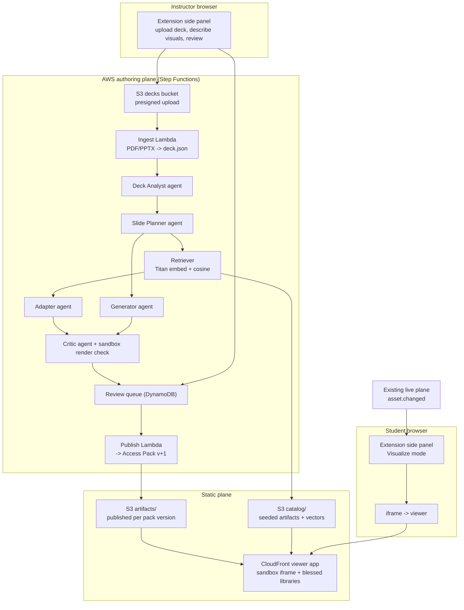

# AccessLens Visualization System

Status: draft spec, 2026-09-15. Owner: solo build, temporary hackathon AWS account.

This document defines the agentic visualization feature: an instructor uploads a
slide deck and describes the visuals they want; an AWS-hosted pipeline of Bedrock
agents finds, adapts, or generates an interactive visualization for each slide;
the instructor reviews and publishes; students see the visualization the moment
the instructor reaches that slide.

It extends `docs/SYSTEM_DESIGN.md`. Where this document and the system design
disagree, this document is the intended behavior for the visualization surface
and the discrepancy should be recorded in `memory/episodic/`.

## 1. Goals and non-goals

Goals:

1. Work for any subject. Nothing here is biology- or CS-specific.
2. Prefer existing, proven interactives over generated code. Retrieve first,
   adapt second, generate last.
3. Every output, regardless of how it was produced, is the same artifact format
   and passes the same sandbox render check before an instructor sees it.
4. Instructor reviews and publishes; students never receive unreviewed output.
5. Ride the existing live plane. The visualization surface adds no new live event
   types; `asset.changed` already carries what students need.
6. Run entirely from the browser plus AWS. No local tooling for the instructor.

Non-goals for the hackathon:

- Live, mid-lecture generation. All generation happens at authoring time.
- Per-class compute. Artifacts are static files on S3 + CloudFront.
- Student-side editing or state persistence beyond the current session.
- Multi-tenant auth. One instructor capability per session is enough.

## 2. Architecture



The extension never executes generated code. Manifest V3 forbids remotely hosted
or runtime-evaluated code inside extension contexts. The student side panel embeds
the viewer as an ordinary `https://` iframe; the viewer is a normal web page and
loads artifacts itself. The viewer's response headers set
`Content-Security-Policy: frame-ancestors chrome-extension://<id> https://<viewer>`.

## 3. Artifact contract

An artifact is one interactive visualization. Retrieved catalog items, adapted
items, and generated items are all artifacts. This is the seam every stage shares.

Layout in S3:

```text
artifacts/{artifactId}/{artifactVersion}/
  manifest.json
  index.html
  assets/**            optional images, models, data
```

`manifest.json`:

```json
{
  "schemaVersion": "1.0",
  "artifactId": "hnsw-search-stepper",
  "artifactVersion": 3,
  "title": "HNSW search, step by step",
  "summary": "Layered graph; step through greedy search with adjustable ef and M.",
  "subjects": ["computer-science", "information-retrieval"],
  "tags": ["graph", "nearest-neighbor", "algorithm-stepper"],
  "interaction": "stepper",
  "provenance": {
    "kind": "adapted",
    "parentArtifactId": "graph-search-stepper",
    "parentArtifactVersion": 1,
    "sourceUrl": "https://example.org/original",
    "license": "MIT",
    "generatedBy": "us.anthropic.claude-sonnet-4-6",
    "jobId": "job_01J..."
  },
  "parameters": {
    "type": "object",
    "properties": {
      "ef": { "type": "integer", "minimum": 1, "maximum": 512, "default": 32 },
      "M": { "type": "integer", "minimum": 2, "maximum": 64, "default": 16 }
    }
  },
  "defaultParameters": { "ef": 32, "M": 16 },
  "libraries": ["d3@7"],
  "accessibility": {
    "description": "A layered graph. Higher layers are sparse; search starts at the top and descends.",
    "keyboard": "Space steps the search. Arrow keys change ef and M.",
    "semanticOutline": ["Layer 2 entry point", "Layer 1 candidates", "Layer 0 result set"]
  },
  "render": {
    "entry": "index.html",
    "minWidth": 480,
    "minHeight": 320
  }
}
```

Rules:

- `provenance.kind` is `catalog`, `adapted`, or `generated`. Adapted requires a
  parent. Generated requires `jobId`.
- `libraries` names only blessed libraries preloaded by the viewer. `index.html`
  must not load scripts from anywhere else; the sandbox CSP enforces this.
- `parameters` is a JSON Schema fragment. The viewer validates instructor-set
  parameters against it before injecting them.
- `accessibility.description` and `keyboard` are required. The critic rejects
  artifacts without them. This keeps the AccessLens promise that every visual has
  an equivalent non-visual route.

Runtime contract inside `index.html`:

```ts
// The viewer calls this after load. The artifact must define it.
window.accesslensInit(params: Record<string, unknown>, ctx: {
  slideTitle: string;
  slideNotes: string;         // instructor-approved narration for this slide
  lessonContext: string;      // short deck-level summary from the analyst
  highlightRegionId?: string; // mirrors region.changed when applicable
}): void;

// Optional. The viewer calls this on region.changed.
window.accesslensHighlight?(regionId: string): void;
```

## 4. Access Pack extension

Add an optional `visualization` object to each Access Pack asset. Schema change in
`packages/contracts/access-pack.schema.json` and `apps/extension/src/shared/contracts.ts`.

```json
{
  "assetId": "cs-slide-07",
  "fingerprint": "...",
  "title": "HNSW search",
  "readingOrder": ["title", "graph"],
  "regions": [],
  "visualization": {
    "artifactId": "hnsw-search-stepper",
    "artifactVersion": 3,
    "parameters": { "ef": 32, "M": 16 },
    "notes": "Ask students to predict which node is visited next.",
    "regionMap": { "graph": "layer-0" }
  }
}
```

`LiveEvent` is unchanged. `asset.changed` carries `packId`, `packVersion`, and
`assetId`; the student extension looks up `visualization` in its cached pack.

## 5. Viewer

A static React + Vite app at `apps/viewer/`, deployed to S3 + CloudFront.

Two layers:

1. **Host page** (`/`). Owns the `postMessage` protocol with the extension and
   with the sandbox. Fetches manifest and validates parameters.
2. **Sandbox iframe** (`/sandbox.html`). `sandbox="allow-scripts"` with no
   `allow-same-origin`, so it is an opaque origin. Its CSP allows
   `script-src 'self' 'unsafe-inline'` plus the blessed library bundle only, no
   network, no storage. Artifacts run here.

Blessed libraries, bundled once and cached:
D3 v7, Three.js + OrbitControls + GLTFLoader, Cytoscape, Plotly basic, Anime.js,
KaTeX, Chart.js. Extend the list only through the viewer build.

Host to extension protocol (`postMessage`, origin-checked both ways):

```ts
type ExtensionToViewer =
  | { type: "viz.load"; packId: string; packVersion: number; assetId: string;
      artifactId: string; artifactVersion: number; parameters: object;
      ctx: { slideTitle: string; slideNotes: string; lessonContext: string } }
  | { type: "viz.highlight"; regionId: string }
  | { type: "viz.freeze" }      // capture.paused
  | { type: "viz.clear" };      // session.ended

type ViewerToExtension =
  | { type: "viz.ready" }
  | { type: "viz.loaded"; artifactId: string; artifactVersion: number }
  | { type: "viz.error"; code: "manifest" | "params" | "render" | "blocked"; message: string };
```

The same viewer with `?mode=harness` is the render check used by the critic
(section 7, stage 6) under headless Chromium.

## 6. AWS stack

One CDK app at `infra/`, TypeScript, one stack, `us-east-1`. Temporary by design;
all resources have `RemovalPolicy.DESTROY`.

| Resource | Purpose |
| --- | --- |
| S3 `decks` | Instructor uploads, presigned PUT, 7-day lifecycle |
| S3 `catalog` | Seeded artifacts, `vectors.json` index |
| S3 `artifacts` | Published artifacts per pack version |
| S3 `viewer` + CloudFront | Viewer app and artifact delivery, one origin |
| DynamoDB `jobs` | Pipeline job state, per-slide status, review decisions, TTL 7 days |
| Step Functions `authoring` | Orchestrates section 7 |
| Lambda per stage | Node 22, TypeScript, esbuild via CDK |
| Lambda `render-check` | Container image with headless Chromium for the harness |
| HTTP API (API Gateway v2) | `POST /jobs`, `GET /jobs/{id}`, `POST /jobs/{id}/review`, `GET /upload-url` |
| Bedrock | `us.anthropic.claude-sonnet-4-6` for agents, `amazon.titan-embed-text-v2:0` for retrieval |

Auth for the hackathon: the instructor capability token the extension already
mints for a session is passed as a bearer header and checked by a Lambda
authorizer. No Cognito.

Bedrock is called only from Lambda. Browser code never holds AWS credentials.

## 7. Authoring pipeline

Step Functions, one execution per uploaded deck. Every agent is Sonnet 4.6 via the
Converse API with a role prompt and a Zod-validated JSON output. Agent prompts live
in `docs/prompts/viz/` and are the source of truth for agent behavior.

| Stage | Kind | Input | Output | Fail behavior |
| --- | --- | --- | --- | --- |
| 1 Ingest | deterministic | PDF or PPTX in `decks` | `deck.json`: per-slide text, notes, rendered PNG, image count | Reject unsupported file; job `failed` |
| 2 Deck Analyst | agent | `deck.json`, instructor description | `lesson.json`: course level, subject, 1-paragraph summary, concept list with slide ranges | Retry once, then job `needs_input` |
| 3 Slide Planner | agent | one slide + `lesson.json` + instructor hints | `plan.json`: `none` / `retrieve` / `adapt` / `generate`, concept, desired interaction, parameters wanted | Default to `none` |
| 4 Retriever | deterministic | plan concept text | top-k catalog artifacts by Titan cosine, k=5 | Empty result forces `generate` |
| 5a Adapter | agent | chosen parent artifact source + plan | new artifact dir with `provenance.kind=adapted` | Fall through to 5b |
| 5b Generator | agent | plan + library docs snippet | new artifact dir with `provenance.kind=generated` | Slide marked `no-visual` |
| 6 Critic | agent + deterministic | artifact dir | manifest schema pass, a11y fields present, harness render with zero console errors, screenshot, Sonnet critique on fidelity to the slide | Up to 2 repair loops back to 5a/5b, then `no-visual` |
| 7 Review | human | screenshot, critique, slide thumbnail, parameters | approve / edit parameters / reject / request regenerate | Waits on instructor |
| 8 Publish | deterministic | approved artifacts | copies to `artifacts/`, writes Access Pack `version+1` with `visualization` fields | Atomic per pack version |

Map state fans out stages 3 through 6 per slide with concurrency 5. Job state in
DynamoDB is updated after every stage so the side panel can show per-slide progress.

"Many agents" is achieved by narrow roles and hard validation between them, not by
more models. Each agent sees only what its stage needs.

## 8. Catalog

The catalog is the moat. Seeding is a build task, not a runtime one.

- `scripts/catalog/` wraps existing open interactives into the artifact format:
  manifest authored with Sonnet assistance from the source README, `index.html`
  patched to call `accesslensInit`, license recorded in provenance.
- Target for the hackathon: roughly 150 artifacts across at least 12 subjects,
  biased toward general shapes: graph algorithms, anatomy hotspot diagrams,
  timelines, function plotters, chemical structures, physics simulations, supply
  and demand curves, state machines, sorting visualizers, map overlays, statistical
  distributions, circuit diagrams.
- Embedding text is `title + summary + tags + subjects`. Vectors stored in
  `catalog/vectors.json` (256 dims, Titan v2). Retrieval is brute-force cosine in
  Lambda; at a few hundred entries this is under 10 ms and needs no OpenSearch.
- Every seeded artifact must pass the same critic harness as generated ones.

## 9. Student experience

- New **Visualize** mode in the student panel alongside Focus, Read, Hear, Locate,
  and AR. Preference is local, like the others.
- On `asset.changed`, if the asset has `visualization`, the panel sends `viz.load`
  to the iframe. If not, the iframe shows the last visualization dimmed with a
  "no interactive for this slide" notice.
- `region.changed` maps through `regionMap` to `viz.highlight`.
- `capture.paused` freezes; `session.ended` clears.
- Keyboard and screen-reader users get `accessibility.semanticOutline` rendered as
  a list beside the iframe, and `accessibility.keyboard` announced on load.

## 10. Safety and invariants

- No student data enters the pipeline. Inputs are the instructor's deck, their
  description, and the catalog.
- Instructor review is mandatory before publish (charter A-series: reviewed packs).
- Artifact code runs only in the opaque-origin sandbox with no network or storage.
- Bedrock prompts and outputs are logged to CloudWatch with deck text redacted to
  slide IDs.
- Provenance and license travel with every artifact.

## 11. Build order and task IDs

Prefix `V`. Each task names its acceptance criterion.

| ID | Task | Done when |
| --- | --- | --- |
| V0 | Artifact manifest schema + Zod + fixtures; `visualization` field on Access Pack | Contract tests pass for two fixtures: one `catalog`, one `generated` |
| V1 | Viewer host + sandbox + blessed bundle + `?mode=harness` | Hand-written HNSW artifact loads from local disk, responds to `viz.load`, `viz.highlight` |
| V2 | CDK stack: buckets, CloudFront, DynamoDB, HTTP API, `GET /upload-url`, `GET /jobs/{id}` | Viewer served from CloudFront; presigned upload from side panel works |
| V3 | Ingest Lambda (PDF first, PPTX after) | 20-slide PDF becomes `deck.json` with PNG per slide |
| V4 | Catalog tooling + 30 seed artifacts + `vectors.json` + Retriever Lambda | Query "nearest neighbor graph search" returns the graph stepper in top 3 |
| V5 | Step Functions with Analyst, Planner, Critic, Publish, and Retriever wired; Adapter and Generator stubbed to `no-visual` | Upload deck, approve a retrieved artifact, published pack has `visualization` |
| V6 | Student Visualize mode consuming published pack over the live plane | Instructor advances slide, student iframe loads artifact within 2 s |
| V7 | Adapter agent + repair loop | Parent artifact re-parameterized for a new slide passes harness |
| V8 | Generator agent + repair loop | Slide with no catalog match yields a passing artifact or clean `no-visual` |
| V9 | Instructor review UI in side panel | Approve, edit params, reject, regenerate all round-trip |
| V10 | Catalog to 150 artifacts, 12 subjects | Retrieval hit rate on a 30-slide mixed-subject test deck above 70 percent |

V0 through V2 have no dependencies on each other. V3 and V4 depend on V0. V5
depends on V1 through V4. V6 depends on V5 and the existing live plane. V7 through
V10 are iterative once V5 and V6 demo end to end.

## 12. Open questions

- PPTX ingest: LibreOffice in a container Lambda for rendering, or require PDF
  export for the hackathon? Recommendation: PDF only until V6 works.
- Harness Lambda cold start with Chromium is 3 to 6 s. Acceptable at authoring
  time; confirm the Step Functions timeout budget.
- Whether the live plane (Part 4 in `docs/PARALLEL_WORKSTREAMS.md`) shares this CDK
  stack. Recommendation: yes, one stack, since one person owns both.
